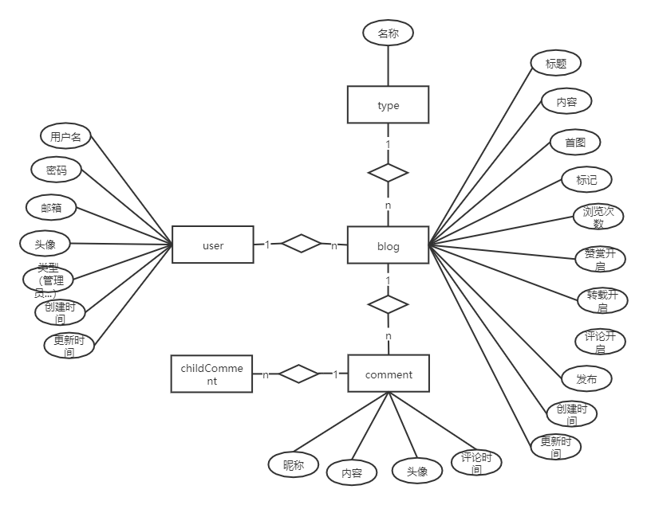

角色：普通访客、管理员


访客

- 分页查看所有博客
- 查看博客数最多的几个分类
- 查看所有分类
- 查看某个分类下的博客列表
- 查看标记博客最多的10个标签
- 查看所有标签
- 查看某个标签下的所有博客
- 根据年度时间线查看博客
- 查看最新的博客
- 关键字全局搜索博客
- 查看单个博客内容
- 对博客进行评论
- 赞赏博客
- 微信扫码阅读博客


管理员

- 用户名密码登录
- 管理博客
    - 发布博客
    - 分类
    - 打标签
    - 修改博客
    - 删除博客
    - 根据标题、分类、标签查看博客
- 管理博客分类
- 管理标签


遇到的问题:

- 页面加载的很慢 需要10多s才能加载完成

    问题本质，通过F12可以看出，访问页面时间都浪费在https://fonts.googleapis.com/css?family=Lato:400,700,400italic,700italic&subset=latin（这个页面是senamtic.min.css请求的）上了，这是谷歌字体，服务器在外国，请求半天最终结果是无法访问；解决办法，将字体下载到本地，将senamtic.min.css也下载到本地（https://files-cdn.cnblogs.com/files/tekikesyo/LocalGoogleFont.zip），并进行替换，在第11行f
    速度问题已经解决了，但是F12发现有3个请求报错，分别是icons.ttf、icons.woff、icons.woff2；解决方法，将相关文件导入（文件在senamtic官网下载的压缩包里面）

    


开发细节：

- mysql表的设计

    er图

    

    表关系：

    - blog-tag  多对多

        一篇博客可以有多个标签，一个标签下也可以有多篇博客

    - blog-comment 一对多

        一篇博客下可以有多条评论

    - blog-user 多对一

        一篇博客下只能属于一个用户，但一个用户可以有多篇博客

    - blog-type 多对一

        一篇博客只能有一种类型，一种类型下可以有多篇博客

    - comment-childComment 一对多

        一条评论下可以有多个子评论

- 页面冗余部分

    使用thymeleaf的th:fragmenthe和th:replace进行简化

    将冗余的标签加上th:fragment属性并命名，全部加载新的一个html文件中

    将原本的部分用th:replace替换

    > **导航栏的高亮**
    >
    > 点击某个页面的时候，加上一个属性activeUri，然后在目标页面中通过该属性的值判断哪个需要高亮

    ```html
    <nav class="ui inverted attached segment m-padded-tb-mini m-shadow-small" th:fragment="topbar">
       <div class="ui container">
            <div class="ui inverted secondary stackable menu">
                <h2 class="ui teal header item">Blog</h2>
                <a href="#" th:href="@{/index}" class="m-item item m-mobile-hide" th:class="${activeUri=='index'?'active m-item item m-mobile-hide':'m-item item m-mobile-hide'}"><i class="home icon"></i>首页</a>
                <a href="#" th:href="@{/types}" class="m-item item m-mobile-hide" th:class="${activeUri=='types'?'active m-item item m-mobile-hide':'m-item item m-mobile-hide'}"><i class="idea icon"></i>分类</a>
                <a href="#" th:href="@{/tags}" class="m-item item m-mobile-hide" th:class="${activeUri=='tags'?'active m-item item m-mobile-hide':'m-item item m-mobile-hide'}"><i class="tags icon"></i>标签</a>
                <a href="#" th:href="@{/archives}" class="m-item item m-mobile-hide" th:class="${activeUri=='archives'?'active m-item item m-mobile-hide':'m-item item m-mobile-hide'}"><i class="clone icon"></i>归档</a>
                <a href="#" th:href="@{/about}" class="m-item item m-mobile-hide" th:class="${activeUri=='about'?'active m-item item m-mobile-hide':'m-item item m-mobile-hide'}"><i class="info icon"></i>关于我</a>
                <div class="right m-item item m-mobile-hide">
                    <div class="ui icon input">
                        <input type="text" placeholder="Search...">
                        <i class="search icon link"></i>
                    </div>
                </div>
            </div>
        </div>
        ...
    </nav>
    ```

    ```html
    <div th:replace="commons/bar::topbar(activeUri='blog')"></div>
    ```
    
- 集成md编辑器

    使用的是editormd

    ```js
    //初始化Markdown编辑器
        var contentEditor;
        $(function () {
            contentEditor = editormd("md-content",{
                width:"100%",
                height:640,
                syncScrolling:"single",
                path:"../lib/editormd/lib/"  //路径一定要正确
            });
        });
    ```
    ```html
    <div class="field">
        <div id="md-content" style="z-index: 1 !important;"><!--将markdown文本框放到最上方以免全屏布局错乱-->
            <textarea name="content" placeholder="博客内容" style="display: none;">
                ### Disabled options
                - TeX (Based on KaTeX);
                -Emoji;
                -Task lists;
                -HTML tags decode;f
            </textarea>
        </div>
    </div>
    ```

- 异常处理

    > 在templates目录下的error目录，springboot会自动根据错误状态码找到对应的错误页面（html页面以状态码命名）

    同时配置异常处理器

    ```java
    @ControllerAdvice //拦截所有Controller的控制器
    public class ControllerExceptionHandler {
    
        private Logger logger = LoggerFactory.getLogger(ControllerExceptionHandler.class); //log4j
    
        @ExceptionHandler(Exception.class) //异常处理
        public ModelAndView exceptionHandler(HttpServletRequest request, Exception e) {
            logger.error("Request Url : {}, exception : {}", request.getRequestURL(), e); //打印访问的url和异常信息
            ModelAndView mv = new ModelAndView();
            mv.addObject("url", request.getRequestURL());
            mv.addObject("exception", e);
            mv.setViewName("error/error");  //跳转到error.html
            return mv;
        }
    }
    ```

- 日志处理

    用spring aop对controller进行拦截

    用环绕通知

    ```java
    ServletRequestAttributes attributes = (ServletRequestAttributes) RequestContextHolder.getRequestAttributes();
    HttpServletRequest request = attributes.getRequest();
    String url = request.getRequestURL().toString();  //访问的url
    String ip = request.getRemoteAddr();   //ip
    String classMethod = pcj.getSignature().getDeclaringTypeName() + "." + pcj.getSignature().getName();  //方法
    Object[] args = pcj.getArgs();  //参数
    RequestLog requestLog = new RequestLog(url, ip, classMethod, args);  //封装
    logger.info("Request : {}" ,requestLog);
    ```


- pageHelper的细节

    采用的是mybatis的xml方式实现分页查询

    > 在xml中写sql时不应在最后加上分号，因为pageHelper在帮我们分页时，会根据参数pageNo和pageSize给sql语句加limit，如果加上分号会报sql语法错误。